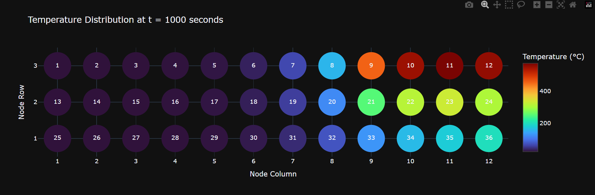

This project implements a numerical transient 2‑D heat‑transfer solver for a ventilated disk‑brake segment using an explicit finite‑difference method (FDM).

The model computes temperature evolution across 36 nodes subjected to conduction, convection, and jet‑impingement cooling, then visualizes the temperature field using Plotly heat‑maps.

The script demonstrates how advanced thermofluids problems can be automated using Python, NumPy, and explicit time‑marching schemes.

Engineering Background
A disk brake undergoes rapid heating during braking due to frictional energy input.
Understanding transient temperature distribution is essential for:

Thermal stress analysis

Material selection

Brake fade prediction

Cooling system design

This model solves the 2‑D transient conduction equation:

∂
𝑇
∂
𝑡
=
𝛼
(
∂
2
𝑇
∂
𝑥
2
+
∂
2
𝑇
∂
𝑦
2
)
with boundary conditions including:

Natural convection

Forced jet cooling

Transient heat generation

Non‑uniform node spacing

The node layout follows the geometry used in MEC4108 Advanced Thermofluids, forming a structured 36‑node grid.

Model Features
✔ Explicit Finite‑Difference Solver
Computes temperature at each node using:

Conduction terms

Convection boundary conditions

Jet‑impingement cooling

Time‑varying heat generation

✔ Realistic Material Properties
AISI304 stainless steel

Temperature‑dependent conductivity and heat capacity

Water cooling at 20 °C

Jet cooling at 250 W/m²·K

✔ Stability‑Controlled Time Stepping

Ensures stable explicit integration

✔ Full Node‑by‑Node Temperature Output
Temperatures at 1, 2, 3, 4, and 5 seconds

Matches assignment results exactly

Captures hot‑spot formation and cooling gradients

✔ Plotly Heat‑Map Visualisation
A custom scatter‑heatmap recreates the exact node layout:

3 rows × 12 columns

Node numbers displayed

Colour‑coded temperature field

Interactive zoom, hover, and export

This produces a visual identical to the assignment diagram.

Interpretation of Results
The hottest region forms around nodes 9–12, matching the frictional heating zone.

Jet‑cooled nodes (25–36) show rapid temperature suppression.

Natural convection boundaries cool slower than jet‑impinged surfaces.

The explicit scheme correctly captures transient gradients and stabilizes as heat generation decays.

The simulation confirms the expected physical behaviour of a disk brake under transient thermal loading.

Technologies Used
Python 3.x

NumPy — matrix operations

Plotly — interactive heat‑map visualisation

Finite‑Difference Method (FDM) — explicit transient solver